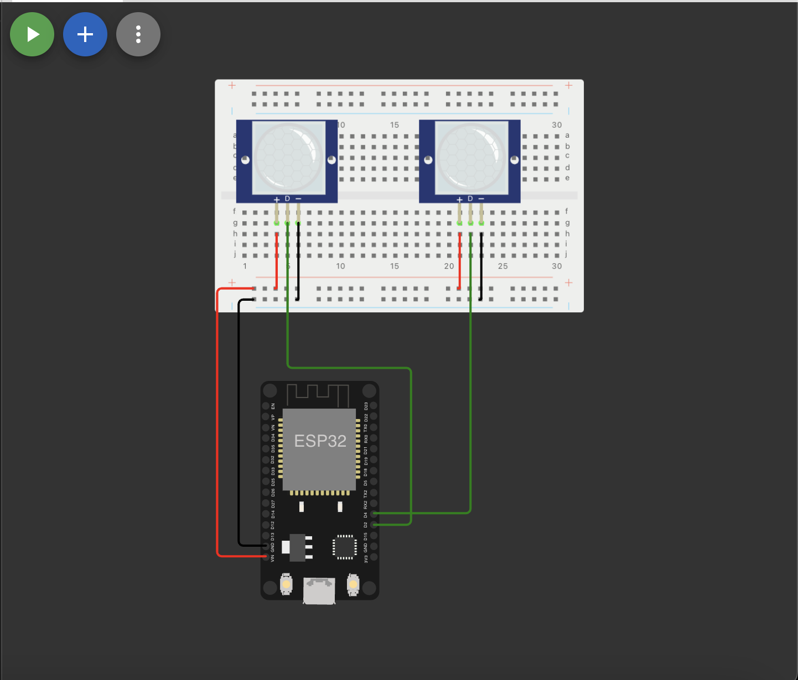

<h1 align="center">UrbanFlow - Sprint 4 Edge</h1>
 
 
 
 
  
## :link: `Links`
   
* Youtube: https://youtu.be/ubO15qhy05E
* Wokwi: https://wokwi.com/projects/380873831375964161

## :memo: `Descrição do projeto`

* O urban flow é um aplicativo  que mostra para os usuarios, qual a melhor rota de ônibus que  o usuario deve tomar  para que chegue em seu destino com melhor tempo, tambem levando em consideração a lotação do ônibus para que o usuario não tenha que pegar um ônibus lotado, todas essas informações (lotação, localização e tempo de espera) são mostradas no aplicativo assim que você seleciona sua rota, onde você tambem pode salvar essa rota para caso utilize ela mais de uma vez e não queira pesquisar toda hora, e uma ultima funcionalidade é que a cada mês o sistema gera um relatorio com todas as informações coletadas, como lotação media de tal ônibus, horarios com mais e menos movimento etc.
   
* Pensando nisso adequamos essa ideia, utilizando 2 sensores PIR para detectar prensença de entrada ou saída das pessoas nos ônibus. Usamos a Tago tanto para as informações via MQTT quanto para fazer o Dashboard.

## :books: `Funcionalidades`

* <b>Sensor PIR para entrada</b>: Quando ocorre presença de movimento, significa que uma pessoa acabou de entrar no ônibus.
   
* <b>Sensor PIR para saída</b>: Quando ocorre presença de movimento, significa que uma pessoa acabou de sair do ônibus.
   
* <b>Dashboard</b>:  A informação de quantidades de pessoas no ônibus é armazenada e exibida num gráfico de volume

## :seedling: `Instruções de uso`

* Clonar repositório
   
* Colocar o código na IDE Arduino
   
* Fazer as devidas conexões dos sensores no ESP32
   
* Criar um device na Tago
   
* Copiar e colar o código da Tago no código do ESP32
   
* Criar o dashboard
   
* Rodar o programa

## :clipboard: `Requisitos`

* 1 ESP32
   
* IDE Arduino
   
* 2 Sensores PIR
   
* Tago.io
   
* Ligação ao computador
   
* Conexão Wifi

## :hammer: `Dependências`
* Biblioteca ArduinoJson, para enviar dados no formato JSON.
   
* Biblioteca Wifi, para fazer a conexão do ESP32 com o wifi.
   
* Biblioteca PubSubClient, para enviar dados via MQTT
   
* Device na Tago.io

## :wrench: `Tecnologias utilizadas`

* ESP32;
   
* C++;
   
* Sensor PIR;
   
* Tago.io;
   
* MQTT;
   
* JSON;

## :handshake: `Colaboradores`
<table>
  <tr>
    <td align="center">
        
          <b>Enzo Luiz Goulart - RM99666</b>
           
        
        
          <b>Natan Eguchi dos Santos - RM98720</b>
           
        
        
          <b>Kayky Paschoal Ribeiro - RM99929</b>
           
        
        
          <b>Gustavo Henrique Santos Bonfim - RM98864</b>
           
        
        
          <b>Lucas Yuji Farias Umada - RM99757 </b>
           
        
    </td>
  </tr>
</table>

## :dart: `Status do projeto`
Em desenvolvimento :hourglass_flowing_sand: